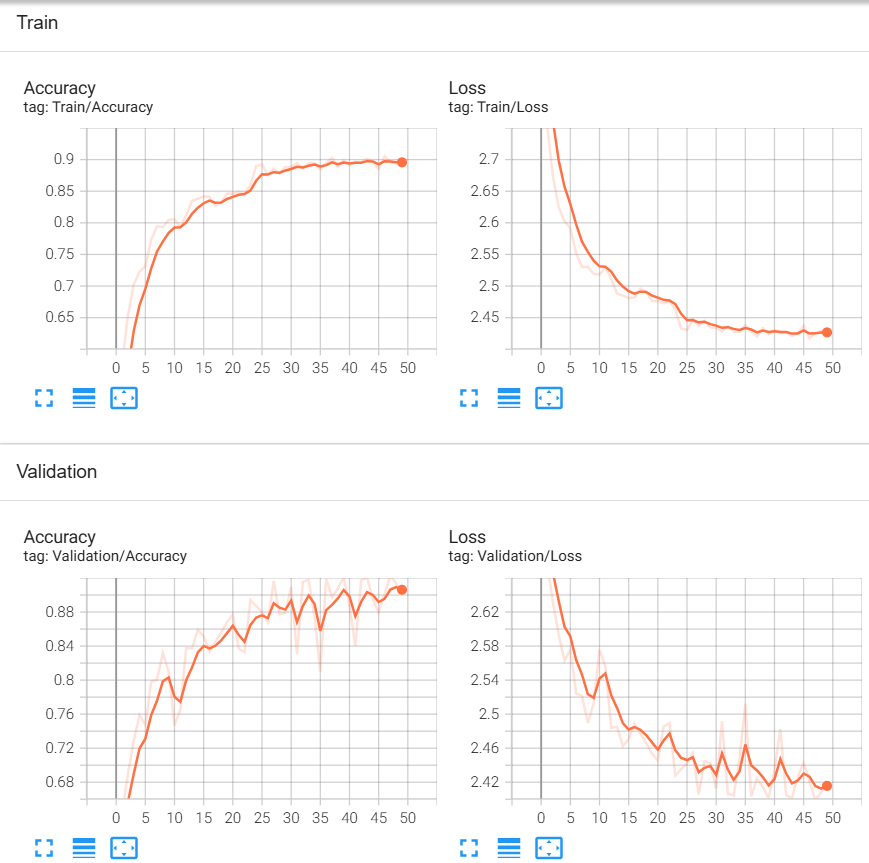

# Hand Gesture Recognization Project
## Introduction
Dự án này nhằm xây dựng một hệ thống nhận diện hình vẽ bằng tay trong thời gian thực, hỗ trợ người dùng tương tác trực quan với máy tính thông qua các cử chỉ tay. Ứng dụng sử dụng camera để theo dõi chuyển động của bàn tay, ghi nhận các nét vẽ và sử dụng mô hình học sâu LSTM để phân loại các hình dạng được vẽ.

## How it works?
Hệ thống hoạt động theo các bước sau:

1. **Thu thập dữ liệu**: Camera ghi lại hình ảnh bàn tay và các chuyển động của ngón tay.
2. **Tiền xử lý**: Ảnh đầu vào được xử lý để phát hiện bàn tay và xác định vị trí các điểm đặc trưng (landmarks) bằng MediaPipe sau đó được tổng hợp vào file .CSV.
3. **Ghi nhận nét vẽ**: Khi người dùng di chuyển ngón trỏ, hệ thống lưu lại các điểm tạo thành đường vẽ.
4. **Trích xuất đặc trưng**: Các điểm vẽ được chuyển thành chuỗi tọa độ, chuẩn hóa và chuyển đổi thành đầu vào cho mô hình học sâu.
5. **Nhận diện hình vẽ**: Mô hình LSTM hoặc CNN phân tích chuỗi điểm để dự đoán class của hình vẽ.
6. **Hiển thị kết quả**: Kết quả nhận diện được hiển thị trực tiếp trên giao diện người dùng.

## Preview
https://github.com/user-attachments/assets/71da15d5-714a-4dcf-90d4-02c6e006b2bc

## Dataset
Dataset gồm các hình ảnh (78000 ảnh) bàn tay tương ứng với 26 ký tự từ **A-Z** ```data/images```

### Validation


## Requirements
- Python 3.12
- MediaPipe
- OpenCV
- Pytorch
- Scikit-learn
- customtkinter (GUI)
